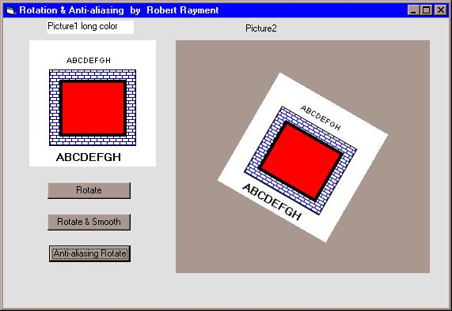



## Anti\-aliasing & Rotation demo

### Description

"Anti-aliasing demo" by Robert Rayment. There are a few anti-aliasing progs on PSC. Mostly they are cleverly convoluted into several subs. I thought I'd stretch out the logic - makes it easier for me to understand and maybe for some of you.
 
### More Info
 
Just run

Picture

             |
---                |---
**Submitted On**   |2001-05-26 22:26:08
**By**             |[Robert Rayment](https://github.com/Planet-Source-Code/PSCIndex/blob/master/ByAuthor/robert-rayment.md)
**Level**          |Intermediate
**User Rating**    |5.0 (50 globes from 10 users)
**Compatibility**  |VB 6\.0
**Category**       |[Graphics](https://github.com/Planet-Source-Code/PSCIndex/blob/master/ByCategory/graphics__1-46.md)
**World**          |[Visual Basic](https://github.com/Planet-Source-Code/PSCIndex/blob/master/ByWorld/visual-basic.md)
**Archive File**   |[Anti\-alias201015262001\.zip](https://github.com/Planet-Source-Code/robert-rayment-anti-aliasing-rotation-demo__1-23476/archive/master.zip)

### API Declarations

Get & SetPixel API's

